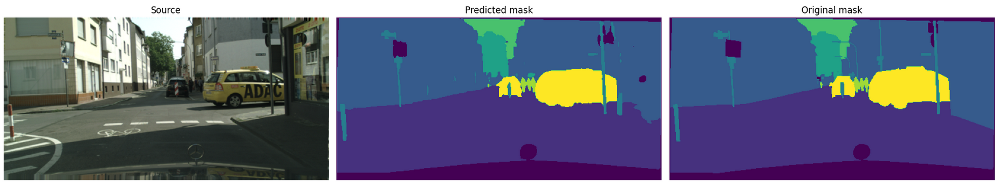
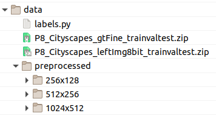

# Semantic Segmentation
## ("Participez à la conception d'une voiture autonome")

[This project is part of the AI Engineer class on OpenClassrooms]

We are provided with a dataset called [Cityscapes](https://www.cityscapes-dataset.com/dataset-overview/) containing **25,000 photos of urban scenes** that has been carefully collected in 50 cities, in the daytime, during 3 seasons and in good or medium weather conditions.

The 25,000 photos are provided with "masks" representing instances or categories. Among these masks, 5000 have fine annotations, 20 000 have coarse annotations, and all files are provided in 2048 x 1024.

For this project, we decided to work with the finely-annotated categorical masks; that is 3475 photographs and 3475 masks (2975 in Test-set / 500 in Validation-set / 0 in Test-set because it's kept for official tests)

>#### The purpose of this project is to train on semantic segmentation and improve my intuitions about:
> - **data-augmentation**
> - **segmentation loss-functions**
> - **segmentation architectures**
> - **time pressure**



1. At first, I will refactor the dataset:
    * with lower resolutions (256x128 and 512x256) in order to speed up the spot checking process,
    * with categorical masks masks for 8 categories instead of 30,
    * with a simpler structure in order to ease the work with the DataGenerator.
    * 
2. Then I will search the best-model configuration:
    * train a baseline model,
    * try several data-augmentations,
    * search for an appropriate loss function,
    * try several architectures specifically designed to solve semantic segmentations.
3. Next I will retrain the best model using a dataset of higher resolution.
4. Finally I will develop an API for inference and deploy the model in the Cloud. 

---


## Running the notebooks online

As the notebooks are sometimes too big to be displayed on GitHub (and because the hyperlinks used for the navigation, doesn't work on GitHub), note that they are also avaible on [nbviewer.org](https://nbviewer.org/github/Valkea/OC_AI_08/tree/main/) and [dagshub.com](https://dagshub.com/Valkea/OC_AI_08) for convenience.


## Running the notebook locally

In order to use this project locally, you will need to have Python and Jupyter notebook installed.
Once done, we can set the environment by using the following commands:


### First, 
let's duplicate the project github repository

```bash
>>> git clone https://github.com/Valkea/OC_AI_08
>>> cd OC_AI_08
```


### Secondly,
let's clone the large file with DVC *(you need to install [DVC](https://dvc.org) prior to using the following command line)*:
```bash
>>> dvc remote add origin https://dagshub.com/Valkea/OC_AI_08.dvc
>>> dvc pull -r origin models/FPN-efficientnetb7_with_data_augmentation_2_diceLoss_512x256.onnx     
```

The second command will collect the final model alone, but if you want to get all the prepared models, you can get them with the following command:

```bash
>>> dvc pull -r origin
```

### Thirdly,
let's create a virtual environment and install the required Python libraries

(Linux or Mac)
```bash
>>> python3 -m venv venvP8
>>> source venvP8/bin/activate
>>> pip install -r requirements.txt
```

(Windows):
```bash
>>> py -m venv venvP8
>>> .\venvP8\Scripts\activate
>>> py -m pip install -r requirements.txt
```


### Finally,
let's configure and run the virtual environment for Jupyter notebook


#### Install jupyter kernel for the virtual environment using the following command:

```bash
>>> pip install ipykernel
>>> python -m ipykernel install --user --name=venvP8
```


#### Select the installed kernel

In order to run the various notebooks, you will need to use the virtual environnement created above.
So once the notebooks are opened (see below), prior to running it, follow this step:


#### Run the jupyter notebooks

To see the notebooks, run:
```bash
>>> jupyter lab
```

* `01_Preprocessing.ipynb` will prepare the preprocessing folder.
* `02_DataGenerators.ipynb` simply shows how the DataGenerator works.
* `03_Spot_checking_models.ipynb` shows the various steps followed to prepare the deployed model.


## Running API server locally using python scripts
Start both API and CLIENT Flask servers:
```bash
(venv) >> python API_CLI_server.py
```

Alternatively, you can run both servers separatly by running the 2 following lines in 2 separate terminals:
```bash
(venv) >> python API_server.py
(venv) >> python CLI_server.py
```
> The former will run on port 5000 by default, and the second on port 5001 *(so the port given in the instructions bellow has to be replaced with 5001 for client url)*. Also the API_server port and url has to be defined in the CLI_server.py file.


Stop with CTRL+C *(once the tests are done, from another terminal...)*


#### Tests

> One can check that the server is running by opening the following url:<br>
> http://0.0.0.0:5000/

> Then you can `post` an image to: (if opened in the browser it will display a upload form for ease of testing)<br>
> http://0.0.0.0:5000/predict <br>
> and it will return a json encoded array of the predicted mask.<br>

> You can also use the simple front-end available here:<br>
> http://0.0.0.0:5000/list <br>
> There you will find a list of the validation images.
> When clicking and ID, the matching image will be send to the /predict url and the json encoded array will be decoded and displayed alongside the orignal photo and the expected mask.

Note that the first request might take some time. But once you've got the first prediction, it should run pretty fast for the others.

## Docker

### Building a Docker image

```bash
>> docker build -t cityscapes_segmentation .
```

### Running a local Docker image

```bash
>> docker run -it -p 5000:5000 cityscapes_segmentation:latest
```

Then one can run the same test steps as before with curl.

Stop with CTRL+C


### Pulling a Docker image from Docker-Hub

I pushed a copy of my docker image on the Docker-hub, so one can pull it:

```bash
>> docker pull valkea/cityscape_segmentation_gpu:latest
```

But this command is optionnal, as running it (see below) will pull it if required.

### Running a Docker image gathered from Docker-Hub

Then the command to start the docker is almost similar to the previous one:

```bash
>> docker run -it -p 5000:5000 valkea/cityscape_segmentation_gpu:latest
```

And once again, one can run the same curve's tests.

Stop with CTRL+C


## Cloud deployement

In order to deploy this project, I decided to use Heroku.

*Here is a great ressource to help deploying projects on Heroku:*
https://github.com/nindate/ml-zoomcamp-exercises/blob/main/how-to-use-heroku.md

So if you don't already have an account, you need to create one and to follow the process explained here: https://devcenter.heroku.com/articles/heroku-cli


#### Create project on Heroku

Once the Heroku CLI is configured, one can login and create a project using the following commands (or their website):

```bash
>> heroku login
>> heroku create cityscapes_segmentation
```


#### Push project to Heroku

Then, the project can be compiled, published and ran on Heroku, with:

```bash
>> heroku container:login
>> heroku container:push web -a cityscapes_segmentation
>> heroku container:release web -a cityscapes_segmentation
```


#### Test project from Heroku's cloud instance

> One can check that the server is running by opening the following url:<br>
> http://cityscape-segmentation.herokuapp.com

> Then you can `post` an image to: (if opened in the browser it will display a upload form for ease of testing)<br>
> http://cityscape-segmentation.herokuapp.com/predict <br>
> and it will return a json encoded array of the predicted mask.<br>

> You can also use the simple front-end available here:<br>
> http://cityscape-segmentation.herokuapp.com/list <br>
> There you will find a list of the validation images.
> When clicking and ID, the matching image will be send to the /predict url and the json encoded array will be decoded and displayed alongside the orignal photo and the expected mask.

Note that all requests will take time  (about 10 seconds) for inference because Heroku doesn't provide GPU instance... so the inference has to be done on CPU which is obviously slower for this problem.

I also deployed the model on [paperspace.com](http://www.paperspace.com), but as this is a per hour instance, it's currently powered off.

#### Uninstalling the venv kernel
Once done with the project, the kernel can be listed and removed using the following commands:

```bash
>>> jupyter kernelspec list
>>> jupyter kernelspec uninstall venvp8
```
